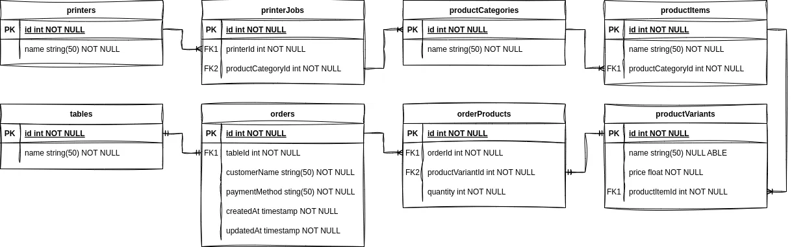

# API Service Order

This repository provides a service for managing orders through an API. The API is documented with Swagger and uses Sequelize for database interaction.

## Table of Contents

- [Installation](#installation)
- [Database Setup](#database-setup)
- [Environment Variables](#environment-variables)
- [Running the Application](#running-the-application)
- [API Documentation](#api-documentation)
- [ERD Database](#erd-database)

## Installation

**Clone the Repository**

```sh
git clone https://github.com/rhyman18/api-service-order.git
cd api-service-order
```

**Install Dependencies**

Ensure you have Node.js installed. Then, install the necessary dependencies:

```sh
npm i
```

## Database Setup

**Import Database Schema**

If you already have MySQL and phpMyAdmin installed, import the database schema from data.sql using your preferred tool (e.g., MySQL Workbench or the MySQL command line):

```sh
mysql -u your_username -p your_database < data.sql
```

If you do not have MySQL and phpMyAdmin installed, you can use Docker to set up MySQL and phpMyAdmin. Ensure Docker is installed on your system, then run:

```sh
docker compose up -d
```

This will start MySQL and phpMyAdmin services as defined in the docker-compose.yml file. You can then access phpMyAdmin at http://localhost:8080 to import the data.sql file.

**Configure Database Connection**

Make sure to configure your database connection settings in the config/config.json file or the environment variables to match the Docker container setup or your local MySQL configuration.

## Environment Variables

Edit a .env file in the root of your project and edit of the following configuration based on your setting, example:

```sh
HOST=http://localhost
PORT=9000
DB_DRIVER=mysql
DB_HOST=localhost
DB_NAME=data
DB_USERNAME=root
DB_PASSWORD=12345678
```

## Running the Application

To start the application, use the following command:

```sh
npm run start
```

This will start the API server, and it should be accessible at http://localhost:9000 (or the port you have configured).

## API Documentation

The API documentation is available via Swagger. After starting the application, you can view the documentation by navigating to:

```sh
http://localhost:9000/api/docs
```

Here you can see detailed information about the available API endpoints and how to use them.

## ERD Database

The Entity-Relationship Diagram (ERD) provides a visual representation of the database structure and relationships between entities. Below is the ERD for the database used in this project:


